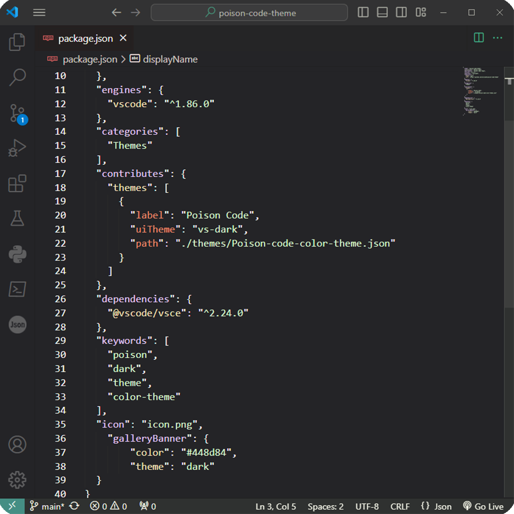

# Poison code [Visual Studio Code](http://code.visualstudio.com)

> A dark theme for lovers of the old style [Visual Studio Code](http://code.visualstudio.com).

## Community

* [GitHub](https://github.com/kilocod3/poison-code-theme) - Best for asking questions and discussing issues.

# Poison code
Poison code: The theme is decorated in the style of python

## Working with Markdown

You can author your README using Visual Studio Code. Here are some useful editor keyboard shortcuts:

* Split the editor (`Cmd+\` on macOS or `Ctrl+\` on Windows and Linux).
* Toggle preview (`Shift+Cmd+V` on macOS or `Shift+Ctrl+V` on Windows and Linux).
* Press `Ctrl+Space` (Windows, Linux, macOS) to see a list of Markdown snippets.

## For more information

* [Visual Studio Code's Markdown Support](http://code.visualstudio.com/docs/languages/markdown)
* [Markdown Syntax Reference](https://help.github.com/articles/markdown-basics/)

**Enjoy!**
